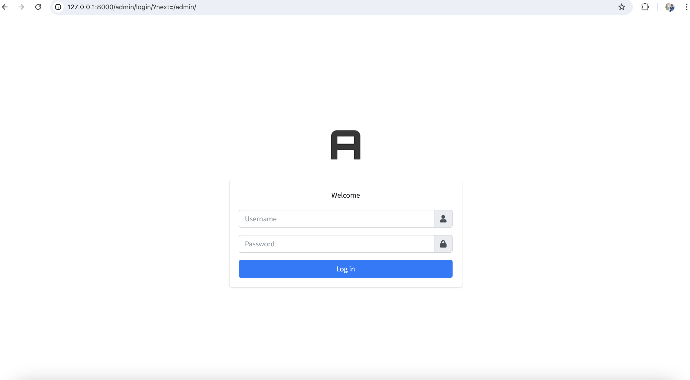

# JWT User & Scope Manager

JWT User & Scope Manager is a web-ased tool designed to simplify the management of users and their associated permissions to be used within JWT (JSON Web Tokens). 
This utility allows administrators to efficiently  activate user, update, and revoke registered user permissions, ensuring secure and fine-grained control over application permissions.

## Key Features:
- **User Management:** Add, modify, and remove users seamlessly.
- **Scope Management:** Define and manage scopes (i.e., permissions) for different levels of user access to be used in REST API endpoints.
- **Intuitive Interface:** A user-friendly dashboard for easy administration of users and scopes.

## Screenshots




## Dependencies
- PostgreSQL: The [docker-postgresql](docker-postgresql) folder contains the docker compose file that can be used to spin up the PostgreSQL database.

## Dependent Application
- [All REST applications that uses fast-api skeleton](https://github.com/sensein/fastapi-skeleton)

## Environment variables
```bash
DB_NAME: name of the database
DB_USER: user name
DB_PASSWORD: password
DB_HOST: database connection URL, default is localhost
DB_PORT: database port number, default is 5432
```